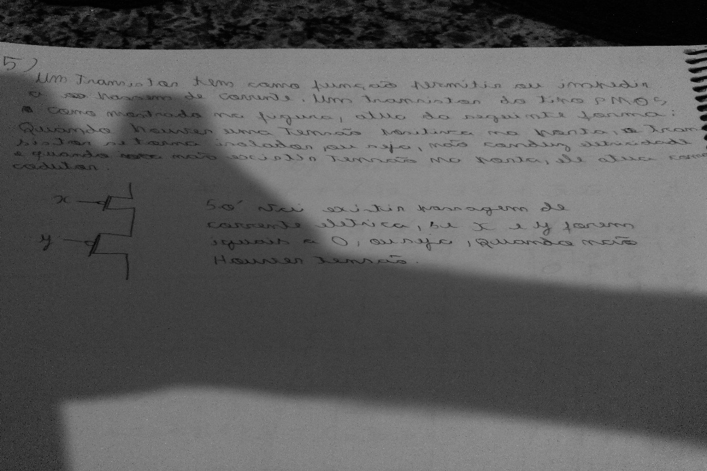
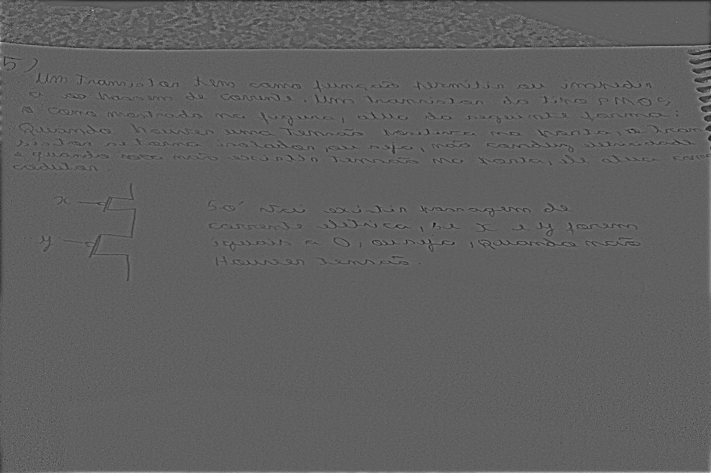

# Exercício  filtro homomórfico
O problema foi resolvido em C++  

Para testar a solução, vá até a pasta [C++](C++) e execute os seguintes comandos:  

```zsh
cd C++ 

mkdir build

cd build 

cmake .. 

make

./homomorphicFilter ../original.jpg 

```

Possível output:  

### original




### output

