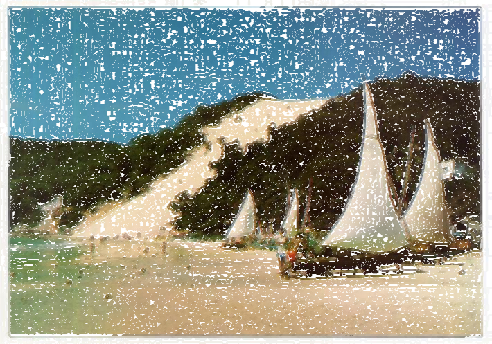

# Exercício  pontilhismo com Canny
O problema foi resolvido em C++  

Para testar a solução, vá até a pasta [C++](C++) e execute os seguintes comandos:  

```zsh
cd C++ 

mkdir build

cd build 

cmake .. 

make

./cannypoints ../../pictures/morroDoCareca.jpg 

# ou
./cannypoints ../../pictures/Lenna.png

```

### Provaveis outputs:



